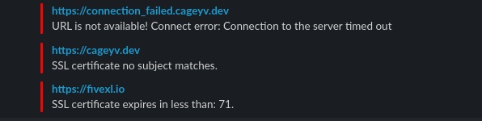

[](https://fivexl.io/)

# AWS SSL Checker Terraform module

Simple SSL check and expiring certificates reminder with additional DNS check and host availability check.

```hcl
module "ssl_checker" {
  source         = "fivexl/ssl-checker/aws"
  version        = "1.0.2"
  hostnames      = ["fivexl.io", "google.com"]
  slack_hook_url = "https://hooks.slack.com/services/XXXXXXX/XXXXXXX/XXXXXXXXXXXX"
}
```

## Requirements

| Name | Version |
|------|---------|
| terraform | >= 0.13 |
| aws | >= 3.19.0 |
| python | >= 3.8 |
| pip | |

## For Mac OS
Please use `build_in_docker = true` and build inside docker for avoid nassl problem

## Inputs

| Name | Description | Type | Default | Required |
|------|-------------|------|---------|:--------:|
| build_in_docker | Build in docker for avoid problems with local environment | `bool` | `false` | no |
| certificate_expiration_notice_days | Days prior to the notification of the expired certificate. | `string` | `"7"` | no |
| cloudwatch_logs_retention_in_days | Specifies the number of days you want to retain log events in the specified log group. Possible values are: 1, 3, 5, 7, 14, 30, 60, 90, 120, 150, 180, 365, 400, 545, 731, 1827, and 3653. | `number` | `14` | no |
| function_name | Lambda function name. | `string` | `"ssl-checker"` | no |
| hostnames | The list of DNS names that should be monitored. Path is also supported. e.g.: [\"example.com\",\"example.com/api\"]. | `list(string)` | | yes |
| health_check_matcher | The response HTTP codes to use when checking for a healthy responses from a hostnames. e.g.: \"200,201,202-399\". | `string` | `"200-399"` | no |
| scan_commands | List of scan commands types witch will run against hostnames. Any type supported by [SSLyze](https://nabla-c0d3.github.io/sslyze/documentation/available-scan-commands.html). | `list(string)` | `["certificate_info", "robot", "tls_compression", "tls_fallback_scsv", "heartbleed","http_headers", "openssl_ccs_injection", "session_renegotiation", "tls_1_1_cipher_suites","tls_1_2_cipher_suites", "tls_1_3_cipher_suites"]` | no |
| schedule_expression | The scheduling expression. How often check hostnames. For example, `cron(0/5 * * * ? *)` or `rate(5 minutes)`. | `string` | `"cron(0/5 * * * ? *)"` | no |
| slack_hook_url | Slack incoming webhook URL. | `string` | | yes |
| tags | Tags to apply on created resources. | `map(string)` | `{}` | no |

## Outputs

| Name | Description |
|------|-------------|

# Function 

## Configuration

Configuration is done via env variables

* `HOOK_URL` - Slack web hook URL where to send events. This is a mandatory parameter.
* `HOSTNAMES` - Comma separated string with domain names. This is a mandatory parameter.
* `HEALTH_CHECK_MATCHER` -  The response HTTP codes to use when checking for a healthy responses from a hostnames. You can specify multiple values (for example, "200,202" for HTTP(s)) or a range of values (for example, "200-299" or "0-99"). Default - `'200-399'`
* `CERTIFICATE_EXPIRATION_NOTICE_DAYS` -  How many days before the expiration date of the certificate to send reminders. Default - `'7'`
* `SCAN_COMMANDS` - Comma separated string with scan commands types witch will run against hostnames. Any type supported by SSLyze.

## Deployment

- Terraform module
- [Docker Image](https://hub.docker.com/r/fivexl/terraform-aws-ssl-checker)

# Example message



# Development

```
bash setup.sh
source env/bin/activate
export SCAN_COMMANDS="certificate_info,robot,tls_compression,tls_fallback_scsv,heartbleed,http_headers,openssl_ccs_injection,session_renegotiation,tls_1_1_cipher_suites,tls_1_2_cipher_suites,tls_1_3_cipher_suites"
export CERTIFICATE_EXPIRATION_NOTICE_DAYS=7
export HEALTH_CHECK_MATCHER=200-399
HOOK_URL="opa" DEBUG=true HOSTNAMES="google.com,g00gle.com" python3 ssl-check-to-slack.py
```